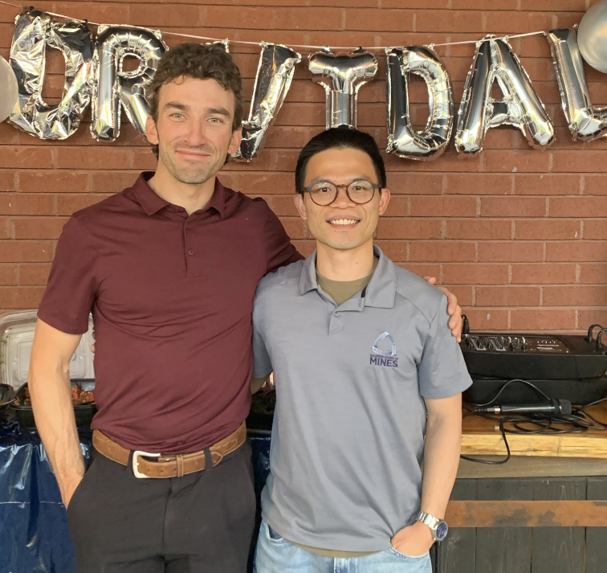
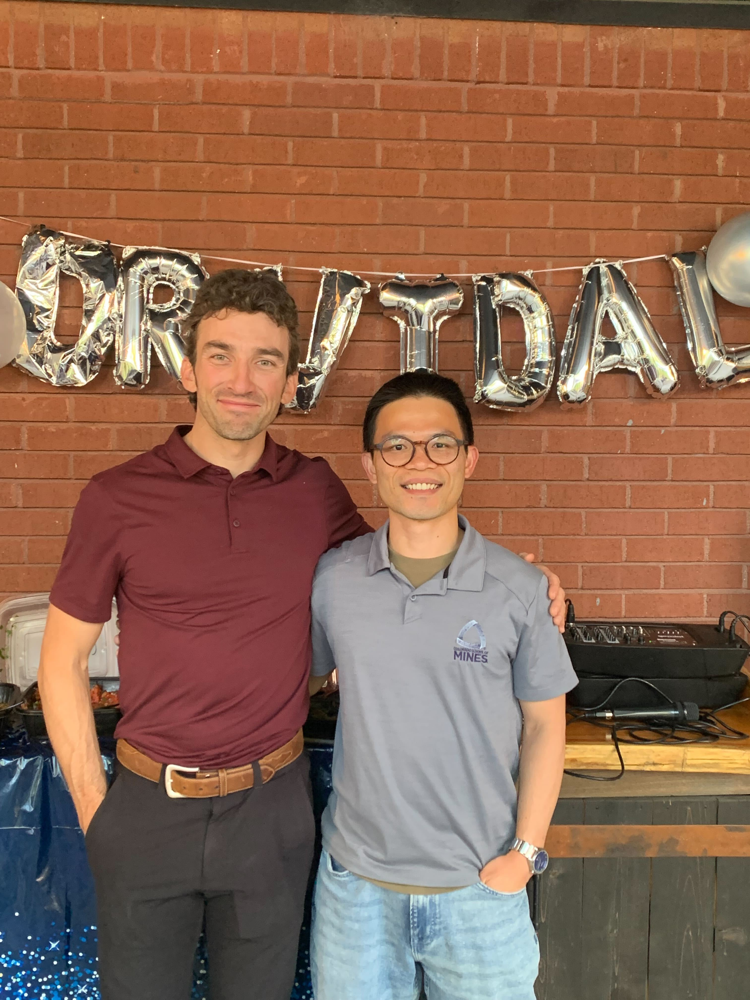
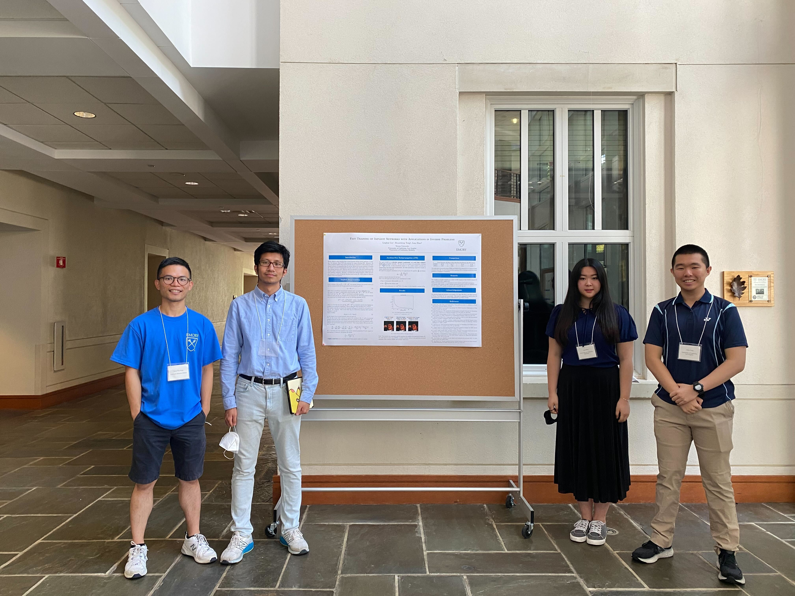

I am an Assistant Professor in the [Department of Applied Mathematics and Statistics](https://ams.mines.edu/) at Colorado School of Mines. I am also an affiliated faculty in the [Department of Computer Science](https://cs.mines.edu/) and am part of the [Mines Optimization and Deep Learning (MODL)](https://ams.mines.edu/optimization-and-deep-learning/) group. Prior to joining Mines, I was an Assistant Adjunct Professor in the Department of Mathematics at UCLA. I received my PhD  in applied mathematics from Emory University in 2019, where I worked under the guidance of [Lars Ruthotto](http://math.emory.edu/~lruthot/). My research interests lie in the intersection of applied mathematics and data science. In particular, I am interested in inverse problems, optimization, optimal control, and deep learning.

<!-- I am currently supported by the National Science Foundation Awards DMS 2309810 and DMS 2110745. -->

<!-- If you are a self-motivated student interested in working in the aforementioned areas, send me an email. -->

<!-- Upcoming Talks
======
* 12/06/2021 [Center for Wave Phenomena Seminar, Colorado School of Mines](https://cwp.mines.edu/seminar/)
* 12/10/2021 Center for Research in Signals and Networks, Colorado School of Mines -->

Recent News
======
* 10/10/2024: Our draft [A Generalization Bound for a Family of Implicit Networks](https://arxiv.org/abs/2410.07427) is out. Thanks to Benjamin Berkels for the collaboration.
* 10/04/2024: Our draft [On Logical Extrapolation for Mazes with Recurrent and Implicit Networks](https://arxiv.org/abs/2410.03020) is out. Thanks to Brandon Knutson, Amandin Chyba, Michael Ivanitskiy, Jordan Pettyjohn, Cecilia Diniz-Behn, and Daniel McKenzie for the collaboration.
* 09/30/2024: Our draft [Mean-Field Control Barrier Functions: A Framework for Real-Time Swarm Control](https://arxiv.org/abs/2409.18945) is out. Thanks to Levon Nurbekyan for the collaboration.
* 08/09/2024: Our draft [Fast Partial Transforms for Large-Scale Ptychography](https://arxiv.org/abs/2408.03532) is out. Thanks to Ricardo Parada and Stanley Osher for the collaboration.
* 08/07/2024: Our draft [A hybrid SIAC -- data-driven post-processing filter for discontinuities in solutions to numerical PDEs](https://arxiv.org/abs/2408.05193) is out. Thanks to Soraya Terrab and Jennifer Ryan for the collaboration.
* 07/19/2024: Our paper [Differentiating Through Integer Linear Programs with Quadratic Regularization and Davis-Yin Splitting](https://arxiv.org/abs/2301.13395) has been accepted by Transactions on Machine Learning Research. Thanks to Daniel McKenzie and Howard Heaton for the collaboration.
* 06/05/2024: Our draft [Laplace Meets Moreau: Smooth Approximation to Infimal Convolutions Using Laplace's Method](https://arxiv.org/abs/2406.02003) is out. Thanks to Ryan Tibshirani, Howard Heaton, and Stanley Osher for the collaboration.
* 05/22/2024: Alex Vidal successfully defends his PhD dissertation and will continue his journey as a Sr. Data Scientist at NerdWallet.
Congratulations, Alex!

<!--  -->

* 05/17/2024: Our draft [Kernel Expansions for High-Dimensional
Mean-Field Control with Non-local Interactions](https://arxiv.org/abs/2405.10922) is out. Thanks to Alex Vidal, Luis Tenorio, Levon Nurbekyan, and Stanley Osher for the collaboration.
* 04/2024: Our draft [Three-Operator Splitting for Learning to Predict Equilibria in Convex Games](https://arxiv.org/abs/2106.00906) has been accepted by SIAM Journal on Mathematics of Data Science. Thanks to Daniel McKenzie, Howard Heaton, Qiuwei Li, Wotao Yin, and Stanley Osher for the collaboration.
* 04/2024: I am honored to receive the 2024 Laney Early Career Alumni Award
<!-- (https://gs.emory.edu/spotlight/deans-address-2024.html). -->
* 12/2023: Our draft [Structured World Representations in Maze-Solving Transformers](https://arxiv.org/abs/2312.02566) is out and has been accepted by the in NeurIPS Workshop on Unifying Representations in Neural Models (UniReps). Thanks to Michael Ivanitskiy, Alex Spies, Tilman Räuker, and everyone else involved for the collaboration.
* 09/2023: Our preprint [A Configurable Library for Generating and Manipulating Maze Datasets](https://arxiv.org/abs/2309.10498) is out. Thanks to Michael Ivanitskiy and everyone else involved for the collaboration, and to AI Safety Camp for the support.
* 07/2023: [NSF-DMS award](https://www.nsf.gov/awardsearch/showAward?AWD_ID=2309810&HistoricalAwards=false) received! This grant will help fund our work on learning to optimize. Thanks to my colleagues and Mines for the help and support.
* 06/2023: Our paper, [Explainable AI via Learning to Optimize](https://arxiv.org/abs/2204.14174) has been accepted by Scientific Reports. Thanks to Howard Heaton for his collaboration.
* 03/2023: It was a great day to have the Mines Optimization and Deep Learning group together.

* 03/2023: Our paper [Taming Hyperparameter Tuning in Continuous Normalizing Flows Using the JKO Scheme](https://www.nature.com/articles/s41598-023-31521-y) has been accepted by Scientific Reports. Thanks to Alexander Vidal, Luis Tenorio, Stanley Osher, and Levon Nuberkyan for their collaboration.
* 03/2023: Our paper [A Hamilton-Jacobi-based Proximal Operator](https://arxiv.org/abs/2211.12997) has been accepted by the Proceedings of the National Academy of Sciences. Thanks to Howard Heaton and Stan Osher for the collaboration.
* 02/2023: Our draft [Faster Predict-and-Optimize
with Davis-Yin Splitting](https://arxiv.org/abs/2301.13395) is out. Thanks to Daniel McKenzie and Howard Heaton for the collaboration.
* 12/2022: Our [SIAM News Article on Learning to Optimize](https://sinews.siam.org/Details-Page/learning-to-optimize-where-deep-learning-meets-optimization-and-inverse-problems) is out. Thanks to Daniel McKenzie and Wotao Yin for the collaboration.
<!-- * 11/2022: Our draft [Taming Hyperparameter Tuning in Continuous Normalizing Flows Using the JKO Scheme](https://arxiv.org/abs/2211.16757) is out. Thanks to Alexander Vidal, Luis Tenorio, Stanley Osher, and Levon Nuberkyan for their collaboration. -->
<!-- * 11/2022: Our draft [A Hamilton-Jacobi-based Proximal Operator](https://arxiv.org/abs/2211.12997) is out. Thanks to Howard Heaton and Stan Osher for the collaboration. -->
<!-- Below is a video of our work -->
<!-- <iframe width="530" height="315" src="https://www.youtube.com/embed/1_H2dXZsgHI" title="YouTube video player" frameborder="0" allow="accelerometer; autoplay; clipboard-write; encrypted-media; gyroscope; picture-in-picture" allowfullscreen></iframe> -->
* 11/2022: Our paper [A Numerical Algorithm for Inverse Problem from Partial Boundary Measurement Arising from Mean Field Game Problem](https://arxiv.org/abs/2204.04851) has been accepted by the journal Inverse Problems. Thanks to Yat Tin Chow, Siting Liu, Levon Nurbekyan, and Stan Osher for the collaboration.
* 11/2022: Our paper [Global Solutions to Nonconvex Problems via Evolution of Hamilton-Jacobi PDEs](https://arxiv.org/abs/2202.11014) has been accepted by the journal Communications on Applied Mathematics and Computation. Thanks to Howard Heaton and Stanley Osher for the collaboration.
* 07/21/2022: It's been a great summer working at the [2022 Emory Computational Mathematics for Data Science REU/RET on Model Meets Data](http://www.math.emory.edu/site/cmds-reuret/summer2022/). Congratulations to Linghai Liu, Lisa Zhou, and Allen Tong (left to right) on a successful REU and poster presentation on implicit deep learning and inverse problems.

* 05/2022: Our draft [Explainable AI via Learning to Optimize](https://arxiv.org/abs/2204.14174) is out. Thanks to Howard Heaton for the collaboration.
* 04/2022: I am humbled to receive the inaugural [2022 MGB-SIAM Early Career Fellowship](https://sinews.siam.org/Details-Page/siam-announces-the-2022-class-of-mgb-siam-early-career-fellows).
* 04/2022: Our draft [A Numerical Algorithm for Inverse Problem from Partial Boundary Measurement Arising from Mean Field Game Problem](https://arxiv.org/abs/2204.04851) is out. Thanks to Yat Tin Chow, Siting Liu, Levon Nurbekyan, and Stan Osher for the collaboration.
* 04/2022: Our draft [Adaptive Uncertainty-Weighted ADMM for Distributed Optimization](https://arxiv.org/abs/2109.01089) has been accepted by the Journal of Applied and Numerical Optimization. Thanks to Jianping Ye and Caleb Wan for the collaboration.
* 02/2022: Our draft [Random Features for High-Dimensional Nonlocal Mean-Field Games](https://arxiv.org/abs/2202.12529) has been accepted by the Journal of Computational Physics. Thanks to Sudhanshu Agrawal, Wonjun Lee, and Levon Nurbekyan for the collaboration.
<!-- * 02/2022: Our draft [Global Solutions to Nonconvex Problems by Evolution of Hamilton-Jacobi PDEs](https://arxiv.org/abs/2202.11014) is out. Thanks to Howard Heaton and Stan Osher for the collaboration. -->
<!-- * 02/2022: Our draft on [A Neural Network Approach for Real-Time High-Dimensional Optimal Control](https://arxiv.org/abs/2104.03270) has been accepted by IEEE Transactions on Control Systems Technology. Thanks to Derek Onken, Levon Nurbekyan, Xingjian Li, Lars Ruthotto, and Stan Osher for the collaboration. -->
<!-- * 12/2021: Our draft [JFB: Jacobian-Free Backpropagation for Implicit Networks](https://arxiv.org/abs/2103.12803) has been accepted by the 36th AAAI Conference on Artificial Intelligence. Thanks to Howard Heaton, Qiuwei Li, Daniel McKenzie, Stan Osher, and Wotao Yin for the collaboration. -->
<!-- Here is a video preview -->
<!-- <iframe src="https://player.vimeo.com/video/669820980?h=9ca3363edb" width="550" height="360" frameborder="0" allow="autoplay; fullscreen; picture-in-picture" allowfullscreen></iframe> -->
<!-- 
<a href="https://vimeo.com/669820980">2022-AAAI-JFB-Trailer</a> from <a href="https://vimeo.com/typal">Typal LLC</a> on <a href="https://vimeo.com">Vimeo</a>.
 -->
<!-- * 12/2021: I will be participating in the [High Dimensional Hamilton-Jacobi PDEs Reunion Program](http://www.ipam.ucla.edu/programs/long-programs/high-dimensional-hamilton-jacobi-pdes/?tab=activities) at IPAM from Jan 5 - 21. -->
<!-- * 12/2021: Our draft [Wasserstein-based Projections with Applications to Inverse Problems](https://arxiv.org/abs/2008.02200#:~:text=Under%20standard%20assumptions%2C%20we%20prove,but%20now%20with%20theoretical%20guarantees.) has been accepted by the SIAM Journal on Mathematics of Data Science. Thanks to Howard Heaton, Alex Lin, Stan Osher, and Wotao Yin for the collaboration. -->

Select Publications
======
* Wu Fung S. Nurbekyan L. [Mean-Field Control Barrier Functions: A Framework for Real-Time Swarm Control](https://arxiv.org/abs/2409.18945). arXiv:2409.18945. 2024
* Tibshirani R, Wu Fung S, Heaton H, Osher S. [Laplace Meets Moreau: Smooth Approximation to Infimal Convolutions Using Laplace's Method](https://arxiv.org/abs/2406.02003), arXiv:2406.02003. 2024
* Wu Fung S. Berkels B. [A Generalization Bound for a Family of Implicit Networks](https://arxiv.org/abs/2410.07427). arXiv: 2410.07427. 2024
* Heaton H, Wu Fung S. [Explainable AI via Learning to Optimize](https://arxiv.org/abs/2204.14174), Scientific Reports, 13 (10103). 2023
* Osher S, Heaton H, Wu Fung S. [A Hamilton-Jacobi-based Proximal Operator](https://arxiv.org/abs/2211.12997), Proceedings of the National Academy of Sciences. 2023
* Wu Fung S, Heaton H, Li Q, McKenzie D, Osher S, Yin W. [JFB: Jacobian-Free Backpropagation for Implicit Networks](https://arxiv.org/abs/2103.12803), AAAI Conference on Artificial Intelligence, 36(6), 6648-6656. 2022
<!-- * Heaton H, Wu Fung S. [Explainable AI via Learning to Optimize](https://arxiv.org/abs/2204.14174), arXiv:2204.14174. 2022 -->
<!-- * Heaton H, McKenzie D, Li Q, Wu Fung S, Osher S, Yin W. [Learn to Predict Equilibria via Fixed Point Networks](https://arxiv.org/abs/2106.00906). arXiv:2106.00906. 2021 -->
<!-- * Lin AT, Wu Fung S, Li W, Nurbekyan L, Osher S. [Alternating the Population and Agent Control via Two Neural Networks to Solve High-Dimensional Stochastic Mean Field Games](https://www.pnas.org/content/118/31/e2024713118), Proceedings of the National Academy of Sciences, 118(31). 2021 -->
* Onken D, Wu Fung S, Li X, Ruthotto L. [OT-Flow: Fast and Accurate Continuous Normalizing Flows via Optimal Transport](https://ojs.aaai.org/index.php/AAAI/article/view/17113), AAAI Conference on Artificial Intelligence, 35(10), 9223-9232. 2021
* Ruthotto L, Osher S, Li W, Nurbekyan L, Wu Fung S. [A Machine Learning Framework for Solving High-Dimensional Mean Field Game and Mean Field Control Problems](https://www.pnas.org/content/117/17/9183), Proceedings of the National Academy of Sciences, 117(17), 9183-9193. 2020

<!-- Team
======
* Alexander Vidal, 4th year AMS PhD student
* Michael Ivanitsky, 2nd year AMS PhD student
* Soraya Terrab, 3rd year AMS PhD student
* Manuel Alejandro Jaimes Caballero, 3rd year Geophysics PhD student -->

<!-- Upcoming Talks
======
* 12/06/2021 [Center for Wave Phenomena Seminar, Colorado School of Mines](https://cwp.mines.edu/seminar/)
* 12/10/2021 Center for Research in Signals and Networks, Colorado School of Mines -->
<!-- * 10/08/2021 [AMS Research Open House](https://ams.mines.edu/colloquia/), Colorado School of Mines -->
<!-- * 10/12/2021 [Statistics, Optimization and Machine Learning Seminar](https://sites.google.com/colorado.edu/statoptml/), University of Colorado, Boulder. -->
<!-- * 10/20/2021 [PDE and Applied Math Seminar](https://mathdept.ucr.edu/events/weekly-seminars), University of California, Riverside -->
<!-- * 10/23/2021 [AMS Fall Western Sectional Meeting](https://www.ams.org/meetings/sectional/2283_progfull.html). -->
